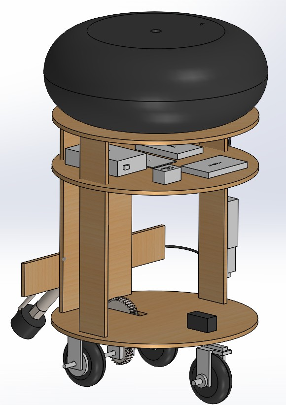
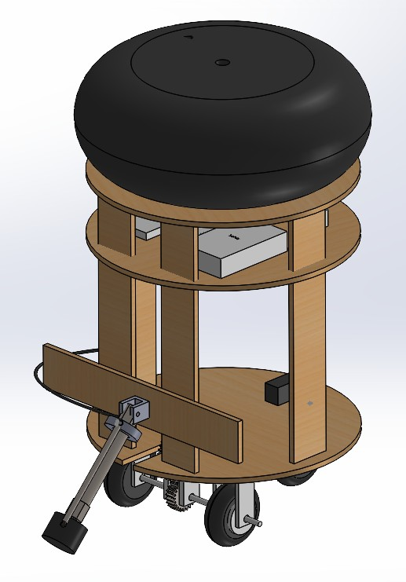
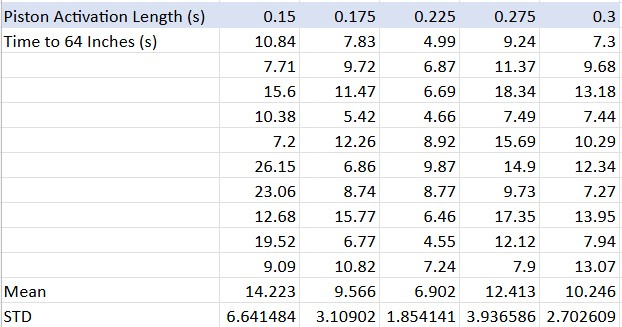
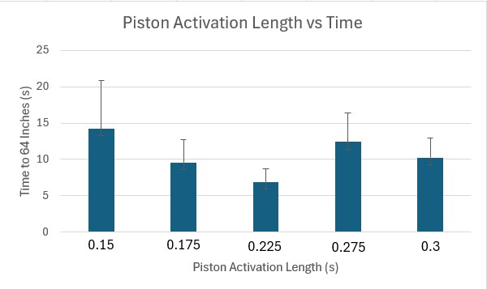
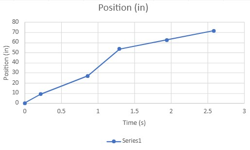
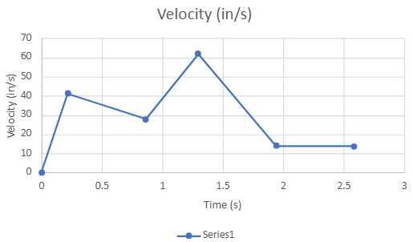
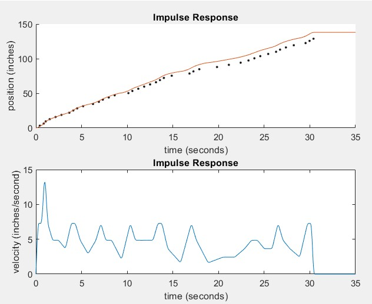

# UCI MAE 106 – Autonomous Pneumatic Robot
### *Attack on the Droid Anthill* | Mechanical Systems Laboratory Final Competition

**Course:** MAE 106 – Mechanical Systems Laboratory, UC Irvine  
**Role:** Mechanical Coordinator  
**Team:** 3 members – Mechanical, Electrical, Controls  
**Timeline:** March 2026 - June 2026  
**Status:** Complete – achieved full credit objective (half-course completion)

---

## Overview

Final project for UCI's MAE 106 lab course. The objective: design, build, and program a robot to autonomously navigate an outdoor trench course in the Engineering Gateway courtyard without any human input after the race starts.

The robot uses a single pneumatic cylinder powered by a compressed air tire for propulsion, a servo motor for steering, and an Arduino microcontroller for autonomous navigation. It orients itself using a magnetometer for bearing and a limit switch for wheel-rotation odometry.

**Competition result:** The robot successfully exited the starting zone, made the first turn, and traveled approximately halfway down the course without falling into the trench – meeting the full-credit objective. It ran out of compressed air before completing the full course.

---

## My Role – Mechanical Coordinator

- Designed full chassis assembly in SolidWorks including frame, wheel mounts, and steering linkage
- Engineered three iterations of the steering system before arriving at a working solution
- Designed three iterations of the propulsion system before arriving at a working solution
- Selected materials: plywood chassis decks, FDM 3D printed steering and mount components (PLA)
- Fabricated components using band saw, drill press, laser cutter, and Bambu X1C 3D printer
- Coordinated mechanical interfaces with Electrical and Controls coordinators

---

## System Architecture

| Subsystem | Final Solution | Notes |
|---|---|---|
| Propulsion | Hopper – pneumatic cylinder pushing against ground via rubber stopper | 3rd iteration |
| Steering | Single servo-driven wheel mounted through base | 3rd iteration |
| Controller | Arduino microcontroller | Electrical coordinator |
| Sensors | Magnetometer (bearing) + limit switch (odometry) | Electrical coordinator |
| Structure | Plywood chassis + FDM 3D printed components | |
| Power | Compressed air tire (max 40 PSI) | |
| Software | Arduino + MATLAB | Controls coordinator |

---

## CAD Model

*Full assembly modeled in SolidWorks.*

---

## Design Iteration

This project required significant mechanical iteration. Both the steering and propulsion systems went through multiple redesigns before a working solution was found. The failures were informative – each one identified a specific constraint that shaped the next design.

---

### Steering – 3 Iterations

**Iteration 1: Ackermann Steering (top-mounted)**  
Classic Ackermann geometry placed on top of the chassis base. The 3D printed components could not support the weight of the robot bearing down on the steering assembly – parts deflected and failed under load.

**Iteration 2: Dual Kingpin with Rack and Pinion**  
Two individual steering uprights with kingpin bolts, gears on top connected to a rack driven by the servo. Same failure mode – the 3D printed uprights couldn't handle the vertical load from the robot's weight, causing the mechanism to bind and fail.

**Iteration 3: Single Servo Wheel (through-base mount) ✓**  
Drilled through the chassis base and mounted the servo body secured to the top of the base, with the servo arm extending underneath. A wheel bracket was attached directly to the servo arm, putting the steered wheel below the base. By securing the servo body to the base rather than relying on printed parts to carry the load, this design transferred forces into the plywood structure rather than the 3D printed components – and it worked.

**Key lesson:** The 3D printed PLA could not function as a structural load-bearing element under the robot's weight. The solution was to offload vertical forces into the plywood base and use the servo and printed parts only for actuation.

---

### Propulsion – 3 Iterations

**Iteration 1: Rack and Pinion on Rear Axle**  
A rack attached to the pneumatic cylinder engaged a pinion gear on the front axle (robot oriented with propulsion in front, steering in back). A one-way bearing on the pinion allowed the robot to move forward on actuation but prevented it from rolling back on the return stroke. The cylinder was too powerful – the impulse force snapped or stripped the 3D printed rack and pinion components.

**Iteration 2: Two-Stage Gear Reduction**  
Added a second gear above the main pinion to distribute the cylinder's force and reversed the bearing direction. The gear reduction helped with force, but the friction between two meshing 3D printed PLA gears was too high – the system bound up and could not reliably transfer power.

**Iteration 3: Hopper Propulsion ✓**  
Mounted the pneumatic cylinder to the rear of the robot, with a rubber stopper attached to the end of the cylinder rod. On actuation, the rod extends and the rubber stopper pushes against the ground, propelling the robot forward. No gears, no axle interface – the ground is the reaction surface. Simple, robust, and effective.

**Key lesson:** Minimizing the number of 3D printed interfaces in the power transfer path was critical. The hopper approach eliminated the gear mesh entirely and used the ground as a reaction surface, making the system far more reliable.

---

## Testing & Results
*Testing conducted collaboratively by the full team.*

### Piston Activation Length vs. Time to 64 Inches

To optimize speed and ensure the robot could cover the required course distance within the competition window, we tested how piston firing duration (activation length) affected the time to travel 64 inches.

*Longer activation lengths provided more impulse per cycle but reduced cycle frequency. Testing identified the optimal duty cycle for consistent forward progress.*

---

### Measured Propulsion Impulse Response

Measured position vs. time and velocity vs. time for the final hopper propulsion system.

---

### Simulated Propulsion Impulse Response

Compared measured propulsion impulse response against a simulated model to validate our understanding of the system dynamics.

## Tools & Skills Used

`SolidWorks` `FDM 3D Printing` `Bambu X1C` `Orca Slicer` `Band Saw` `Drill Press` `Laser Cutter` `Arduino` `Pneumatic Systems`
`Mechanical Design` `Fabrication` `System Integration` `Technical Documentation`

---

## Reflection

The robot achieved its full-credit objective, but the path to get there involved rebuilding both primary mechanical systems multiple times under a tight course deadline. The core constraint we kept running into was the same: 3D printed PLA cannot reliably serve as a structural load-bearing element when the full weight of the robot is in play. Once we understood that constraint clearly, the solutions became more obvious – move the loads into the plywood base, minimize printed interfaces in the power path, and keep the actuation mechanisms simple.

The iteration process, while frustrating in the moment, produced a more robust final design than the original concept would have.
